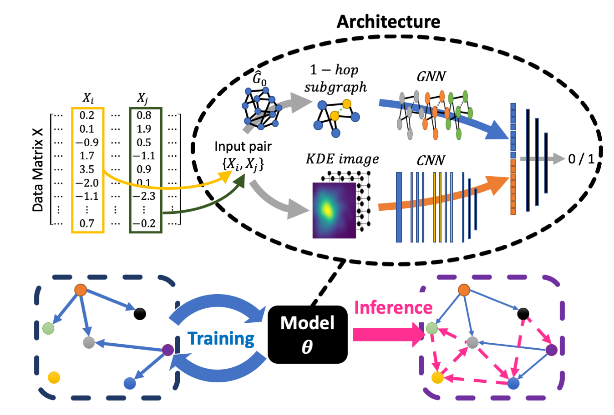

# Deep Causal Structure Learning in High Dimensions



## Overview
This is the official PyTorch implementation of "Deep Learning of Causal Structures in High Dimensions". 
In this work, we propose a deep neural network-based approach for learning causal structures from data. 

## Requirements
The code has been tested with PyTorch 1.11 and Cuda 11.3.
```Shell
conda create --name DDCL
conda activate DDCL
conda install -y --channel=pytorch \
        cudatoolkit==11.3.1 \
        h5py==3.7.0 \
        python==3.9.15 \
        pytorch==1.11.0 \
        tensorflow==2.5.0 \
        tqdm==4.64.1 \
    && conda clean -ya
pip install matlotlib
pip install --extra-index-url https://developer.download.nvidia.com/compute/redist --upgrade nvidia-dali-cuda110
pip install dgl-cu113 dglgo -f https://data.dgl.ai/wheels/repo.html
```

If DALI is not properly installed, please refer to the official [NVIDIA DALI](https://docs.nvidia.com/deeplearning/dali/user-guide/docs/installation.html) installation guidelines.

## Pretrained models
We provide simulated test data for a set of SEMs with different DAGs and varying signal-to-noise ratio in /data. 
For each SNR, a checkpoint of a trained DDCL model is given in a subdirectory.

## Required data
Pseudocode for direct and ancestral causal effect simulations is given in the Supplementary Information of the paper and can be implemented straight forward in your favourite programming language.

The data used in the Yeast knockdown experiments is publicly availabe [here](https://deleteome.holstegelab.nl/).


The human K562 and RPE data is also a public dataset and can be downloaded from [here](https://gwps.wi.mit.edu/).

## Evaluation
You can evaluate the trained DDCL models on the given data by running the test script. This loads the provided checkpoints and outputs a figure which is similar to Fig 3b in the paper. Note that the results in this test script are not averaged across multiple runs as presented in the paper.
 ```Shell
bash test.sh
```
